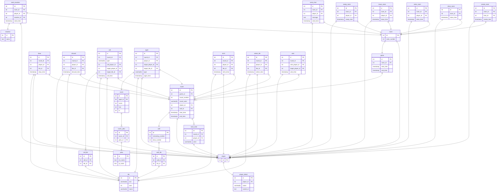

```mermaid
erDiagram
  create_room {
    int id PK
    int room_id FK
    int host_id FK
    timestamp create_time
  }
  create_room ||--|| room : ""
  create_room ||--|| player : ""

  close_room {
    int id PK
    int room_id FK
    timestamp close_time
  }
  close_room ||--|| room : ""
  close_room ||--|| player : ""

  enter_room {
    int id PK
    int room_id FK
    int player_id FK
    timestamp enter_time
  }
  enter_room ||--|| room : ""
  enter_room ||--|| player : ""

  leave_room {
    int id PK
    int room_id FK
    int player_id FK
    timestamp leave_time
  }
  leave_room ||--|| room : ""
  leave_room ||--|| player : ""

  ready_room {
    int id PK
    int room_id FK
    int player_id FK
    timestamp ready_time
  }
  ready_room ||--|| room : ""
  ready_room ||--|| player : ""

  room {
    int id PK
    int room_number
  }
  room ||--o{ player : ""
  room ||--|| game : ""

  player {
    int id PK
  }
  player ||--|| player_detail : ""

  player_detail {
    int id PK
    int player_id FK
    varchar(8) name
    text socket_id
  }

  game {
    int id PK
    int room_id FK
    timestamp start_time
    timestamp end_time
  }
  game ||--o{ round : ""

  round {
    int id PK
    int game_id FK
    int round_number
    varchar(5) round_wind
    int dealer_id FK
    int wall_id FK
    timestamp start_time
    timestamp end_time
  }
  round ||--|{ seat_wind : ""
  round ||--|| player : ""
  round ||--|| wall : ""

  seat_wind {
    int id PK
    int round_id FK
    int player_id FK
    varchar(5) wind
  }
  seat_wind ||--|| player : ""

  wall {
    int id PK
    int remaining_number
    int dora_number
  }
  wall ||--o{ wall_tile : ""

  wall_tile {
    int id PK
    int wall_id FK
    int tile_id FK
  }
  wall_tile ||--|| tile : ""

  tile {
    int id PK
    varchar(6) suit
    int rank
    varchar(5) name
  }

  draw {
    int id PK
    int round_id FK
    int player_id FK
    int tile_id FK
    timestamp draw_time
  }
  draw ||--|| round: ""
  draw ||--|| player: ""
  draw ||--|| tile: ""

  discard {
    int id PK
    int round_id FK
    int player_id FK
    int tile_id FK
    timestamp discard_time
  }
  discard ||--|| round: ""
  discard ||--|| player: ""
  discard ||--|| tile: ""

  call {
    int id PK
    int round_id FK
    varchar(9) type
    int call_player_id FK
    int target_player_id FK
    int target_tile_id FK
    timestamp call_time
  }
  call ||--|| round: ""
  call ||--|| player: ""
  call ||--|| tile: ""
  call ||--o{ call_tile: ""

  call_tile {
    int id PK
    int call_id FK
    int tile_id FK
  }
  call_tile ||--|| tile: ""

  agari {
    int id PK
    int round_id FK
    int player_id FK
    int target_player_id FK
    int target_tile_id FK
    varchar(5) type
    timestamp agari_time
  }
  agari ||--|| round: ""
  agari ||--|| player: ""
  agari ||--|| tile: ""
  agari ||--|| score: ""

  score {
    int id PK
    int agari_id FK
    int score
    int han
    int fu
  }
  score ||--|{ score_yaku: ""

  score_yaku {
    int id PK
    int score_id FK
    int yaku_id FK
  }
  score_yaku ||--|| yaku: ""

  yaku {
    int id PK
    text en_name
    text ja_name
  }

  riichi {
    int id PK
    int round_id FK
    int player_id FK
    int tile_id FK
    timestamp riichi_time
  }
  riichi ||--|| round: ""
  riichi ||--|| player: ""
  riichi ||--|| tile: ""

  select_tile {
    int id PK
    int round_id FK
    int player_id FK
    int tile_id FK
    timestamp select_time
  }
  select_tile ||--|| round: ""
  select_tile ||--|| player: ""
  select_tile ||--|| tile: ""

  vote {
    int id PK
    int round_id FK
    int vote_player_id FK
    int target_player_id FK
    timestamp vote_time
  }
  vote ||--|| round: ""
  vote ||--|| player: ""

  send_chat {
    int id PK
    int room_id FK
    int player_id FK
    text message
    timestamp send_time
  }
  send_chat ||--|| room: ""
  send_chat ||--|| player: ""

  reaction {
    int id PK
    text name
  }

  send_reaction {
    int id PK
    int room_id FK
    int player_id FK
    int reaction_id FK
    timestamp send_time
  }
  send_reaction ||--|| room: ""
  send_reaction ||--|| player: ""
  send_reaction ||--|| reaction: ""
```
